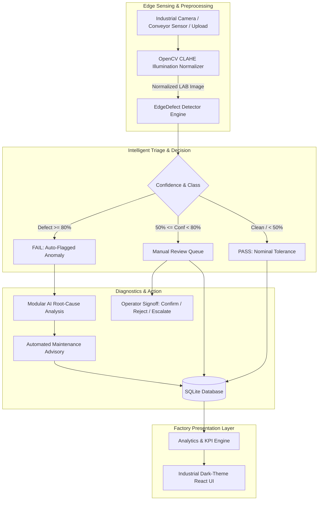

# PRIVISA – EdgeDefect AI
### Intelligent Industrial Surface Inspection & Automated Root-Cause Analysis

> **Hackathon Prototype**: High-speed, edge-deployable surface defect inspection for factory manufacturing lines. Engineered with real OpenCV CLAHE lighting normalization, multi-class defect detection (Scratch, Crack, Dent, Discoloration), deterministic Root-Cause Analysis (RCA) equipment attribution, automated maintenance advisory dispatch, and a manual review queue for borderline predictions (50%–80%).

---

## Architecture Overview



---

## Supported Defect Classes

1. **Scratch**: Linear abrasion or groove typically caused by seized conveyor roller bearings, guide rail debris, or chute friction.
2. **Crack**: High-stress radial, branching, or fatigue fractures caused by excessive stamping tonnage or die tooling micro-fissures.
3. **Dent**: Concave impact deformation caused by pneumatic clamp pressure spikes, degraded cushion bumpers, or robotic transfer arm over-travel.
4. **Discoloration**: Thermal oxidation temper gradients or coolant chemical burn film caused by induction heater thermocouple drift or blocked coolant nozzles.

---

## System Components

### 1. Computer Vision & OpenCV CLAHE (`backend/services/preprocessing.py`)
- **Real OpenCV CLAHE Implementation**: Uses `cv2.createCLAHE(clipLimit=2.5, tileGridSize=(8, 8))`.
- **Color Invariance**: Converts images into LAB color space and applies adaptive histogram equalization specifically to the **L (Lightness)** channel, normalizing harsh shadows and specular glare without altering material chromaticity.
- **Benchmark Speed**: Executes in **~3.8ms – 5.0ms** per frame.

### 2. Defect Detection Engine (`backend/services/detector.py`)
- **Simulation Mode**: Built for hackathon demonstrations; generates realistic bounding boxes, class labels, and confidence metrics without requiring physical hardware or pre-compiled GPU weights.
- **Modular Interface**: Implements `BaseDefectDetector` abstract class, making it a drop-in replacement for YOLOv8 or ONNX Runtime.

### 3. Root-Cause Analysis (RCA) Engine (`backend/services/rca_engine.py`)
- **Deterministic Heuristic Diagnostics**: Correlates defect classification, spatial orientation (e.g., linear horizontal vs. radial), and machine equipment telemetry to pinpoint exact mechanical components (e.g., *Conveyor Belt Roller #2*, *Stamping Die Press #1*).
- **Automated Work Directives**: Outputs specific corrective instructions, priority (`CRITICAL`, `HIGH`, `MEDIUM`, `LOW`), and urgency deadlines.
- **External AI Hook**: Ready to be plugged into foundation LLM APIs (Gemini 2.0 Flash, Claude, local Ollama).

### 4. Human-In-The-Loop Review Queue (`backend/database.py` & `src/pages/ReviewQueue.jsx`)
- **Threshold Rule**: Predictions with confidence between **50% and 80%** are automatically placed in the review queue.
- **Operator Actions**:
  - **Confirm**: Verifies genuine defect $\rightarrow$ converts to `FAIL`.
  - **Reject**: Dismisses false positive $\rightarrow$ reclassifies as approved `PASS`.
  - **Escalate**: Dispatches to senior metallurgist / QA lead.

### 5. Persistent SQLite Storage (`backend/database.py`)
- Automatically seeds **28 realistic historical inspections** covering all 4 defect types, borderline review items, and clean nominal parts across 4 factory machines (*Machine 01* to *Machine 04*).

---

## Technology Stack

- **Frontend**:
  - React 18
  - Vite 8
  - Tailwind CSS 4
  - Recharts
  - Lucide React
- **Backend**:
  - Python 3.11
  - FastAPI
  - Uvicorn
  - OpenCV Headless (`cv2`)
  - NumPy & Pillow
  - SQLite3
  - Pydantic v2

---

## Installation & How to Run

### Prerequisites
- Node.js (v18+)
- Python (3.10+)

### 1. Backend Setup
```bash
cd backend
# Install dependencies
python -m pip install fastapi uvicorn opencv-python-headless numpy pillow pydantic python-multipart

# Start the FastAPI backend server
python -m uvicorn main:app --host 127.0.0.1 --port 8000 --reload
```
The backend API and Swagger docs will be live at:
- **API Root**: `http://127.0.0.1:8000`
- **Interactive Swagger Docs**: `http://127.0.0.1:8000/docs`

### 2. Frontend Setup
```bash
cd frontend
# Install npm dependencies
npm install

# Start the Vite development server
npm run dev
```
The frontend UI will be live at:
- **Application Dashboard**: `http://localhost:5173/`

---

## 2-Minute Hackathon Demonstration Script

Follow this step-by-step walkthrough during your pitch:

1. **Dashboard Overview (0:00 - 0:25)**:
   - Point out key metrics: Total Inspections, Pass Rate, Average Detection Latency (**~32ms**), and 4 Active Machines.
   - Show the Defect Class Distribution donut chart (Scratch, Crack, Dent, Discoloration) and real-time confidence trend line.
2. **Live Conveyor Inspection (0:25 - 0:55)**:
   - Navigate to **Live Inspection**.
   - Click **"START INSPECTION"** to launch continuous conveyor feed.
   - Observe parts moving through the optical scanner with real-time bounding boxes and PASS/FAIL stamps.
   - Toggle **"Lighting Correction (CLAHE)"** to showcase OpenCV normalizing specular glares in real time.
3. **Trigger Defect & Generate Root-Cause Advisory (0:55 - 1:25)**:
   - Click the red banner or inspect a defective part (e.g. *Scratch*).
   - Click **"Generate Root Cause Advisory"**.
   - Show how the AI attributes the scratch to **"Conveyor Belt Roller #2"**.
   - Click **"Generate Maintenance Advisory"** to reveal the official engineering work order ticket ready for maintenance dispatch.
4. **Image Analysis & Side-by-Side Comparison (1:25 - 1:40)**:
   - Navigate to **Image Analysis**.
   - Select any sample or upload a file.
   - Use the **Split Slider** and **Dual View** to contrast the raw unnormalized camera feed against the OpenCV CLAHE-corrected image.
5. **Manual Review Queue (1:40 - 1:55)**:
   - Navigate to **Review Queue**.
   - Explain the human-in-the-loop logic: predictions with confidence between **50% and 80%** are caught here to eliminate both false stops and defect escapes.
   - Click **"Confirm"** on a borderline prediction to mark it as resolved defect.
6. **Analytics & Prototype Targets (1:55 - 2:00)**:
   - Open **Analytics** and highlight the Prototype Target cards:
     - **Detection Accuracy**: 95%+ *(Prototype Target)*
     - **Target Latency**: <50ms *(Prototype Target)*
     - **Downtime Reduction**: 80% *(Prototype Target)*

---

## API Endpoints Reference

| Method | Endpoint | Description |
|---|---|---|
| `GET` | `/api/health` | System health, OpenCV and engine status |
| `GET` | `/api/samples` | Library of synthetic industrial parts ready for 1-click test |
| `POST` | `/api/preprocess` | Applies OpenCV CLAHE with configurable `clip_limit` & `tile_grid_size` |
| `POST` | `/api/analyze` | Full pipeline: Ingestion $\rightarrow$ CLAHE $\rightarrow$ Detection $\rightarrow$ RCA |
| `POST` | `/api/inspect` | Conveyor inspection simulation; saves record to SQLite |
| `POST` | `/api/root-cause` | Generates component attribution & maintenance advisory |
| `GET` | `/api/inspections` | Query historical inspection telemetry |
| `GET` | `/api/review-queue`| Query borderline items (50%–80% confidence) |
| `POST` | `/api/review` | Operator action (`confirm`, `reject`, `escalate`) |
| `GET` | `/api/machines` | Equipment status, health index, defect frequencies |
| `GET` | `/api/analytics` | Aggregated KPIs, defect distributions, prototype targets |
| `POST` | `/api/seed` | Resets SQLite database with 28 fresh demo records |

---

## How to Replace Simulated YOLO with a Real YOLOv8 Model

The detection module is designed with an abstract strategy pattern (`BaseDefectDetector`). Follow these steps to deploy custom-trained YOLOv8 weights:

### Step 1: Train YOLOv8 Model
```bash
yolo task=detect mode=train model=yolov8n.pt data=defect_dataset.yaml epochs=50 imgsz=640
```
*(With 4 target classes: 0: Scratch, 1: Crack, 2: Dent, 3: Discoloration)*

### Step 2: Export to ONNX Format
```bash
yolo export model=runs/detect/train/weights/best.pt format=onnx opset=12 simplify=True
```
Copy `best.onnx` to `backend/models/yolov8_edgedefect.onnx`.

### Step 3: Enable `YOLOv8ONNXDetector` in `backend/services/detector.py`
Uncomment the ONNX Runtime inference block in `backend/services/detector.py`:
```python
import onnxruntime as ort

class YOLOv8ONNXDetector(BaseDefectDetector):
    def __init__(self, onnx_model_path="backend/models/yolov8_edgedefect.onnx"):
        self.session = ort.InferenceSession(
            onnx_model_path, 
            providers=['CUDAExecutionProvider', 'CPUExecutionProvider']
        )
        self.input_name = self.session.get_inputs()[0].name

    def detect(self, image_bgr: np.ndarray, metadata=None):
        # 1. Resize & normalize image to 640x640 float32
        resized = cv2.resize(image_bgr, (640, 640))
        tensor = resized.transpose(2, 0, 1)[None, ...].astype(np.float32) / 255.0
        
        # 2. Run ONNX session
        outputs = self.session.run(None, {self.input_name: tensor})
        
        # 3. Post-process boxes and non-max suppression (NMS)
        # Return defect_type, confidence, boxes, inference_time_ms
```
Then set:
```python
detector = YOLOv8ONNXDetector()
```

---

## Future Roadmap

1. **Hardware Camera Integration**: Direct RTSP, USB3 Vision, and GigE industrial camera streams (`cv2.VideoCapture`).
2. **Edge Hardware Acceleration**: Deploy ONNX Runtime via TensorRT on NVIDIA Jetson Orin or Google Coral Edge TPU.
3. **Active Learning Feedback Loop**: Automatically export confirmed review queue images to a continuous re-training pipeline.
4. **Thermal & Multi-Spectral Fusion**: Blend infrared thermography with optical feeds for subsurface micro-crack detection.
